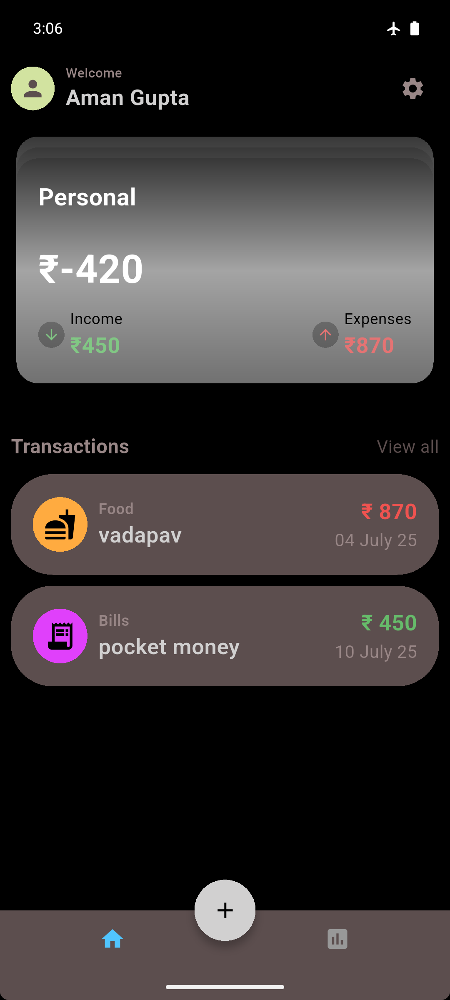
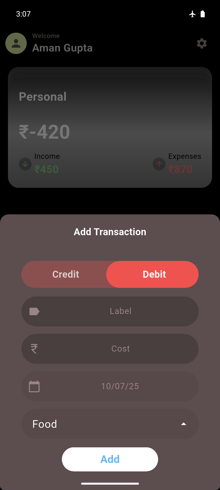

**Poorometer** is a fully functional, scalable expense tracker app built using **Flutter** and **Firebase**.  
It’s designed to help users manage multiple expense cards, track transactions, and visualize weekly spending—while keeping the architecture clean, modular, and ready to scale.

  
  

---

## 🚀 Features

- **User Authentication**  
  - Firebase Authentication for persistent user sessions  
  - Sign Up / Login / Logout  
  - Password updates, username change  
  - Full account deletion (wipes all user data)

- **Expense Tracking (Per Card)**  
  - Supports multiple cards: *Personal*, *Business*, *Savings*  
  - Swipe between cards to view specific transactions  
  - Transactions automatically linked to selected card  
  - Easy transaction creation with dynamic card association

- **Statistics & Analytics**  
  - Weekly spending graph powered by `fl_chart`  
  - Automatic updates as user adds/removes transactions  

- **Settings & Data Controls**  
  - Reset transactions and cards  
  - Secure password change & username updates  
  - Account deletion for full data removal

- **Additional Features**  
  - Pull-to-refresh for real-time Firebase sync  
  - Clean separation between UI, business logic, and backend layers using BLoC & Repository pattern  
  - Modular backend as a separate Dart package (managing Firebase operations)

---

## 🏗️ Tech Stack

- **Flutter** (Frontend)
- **Firebase Authentication** (User Management)
- **Firebase Firestore** (Database)
- **BLoC (Business Logic Component)** (State Management)
- **fl_chart** (Graphs & Charts)
- Custom **Dart** Backend Package (for Firebase operations)

---

## 📊 App Flow

1. User signs in or signs up.
2. Selects between **Personal / Business / Savings** cards (swipeable UI).
3. Adds or views transactions linked to the selected card.
4. Tracks expenses over the week via the Stats page graph.
5. Manages settings, including data resets and account operations.

---

## 🎯 Current Status:  
✅ Core features complete and functional  
✅ Firebase integration working end-to-end  
✅ Ready for future feature expansions or UI polishing

---

## ⚠️ Disclaimer:
It’s built with a focus on clean architecture, modularity, and real-world app structure.
> You can use this app for Yours personal app without any worry🥰

---

used under MIT License
